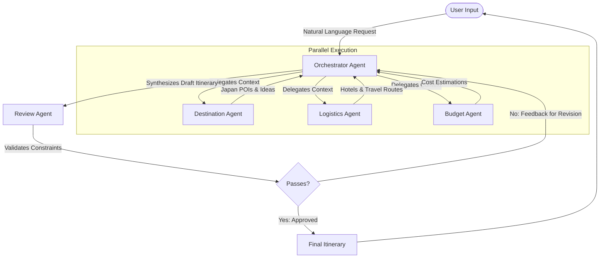

# Multi-Agent Trip Planner Architecture (Japan Focus)

## 1. System Overview
The system employs a multi-agent framework designed to convert natural language travel requests into detailed, day-by-day itineraries tailored for Japan. The architecture uses a central Orchestrator that delegates sub-tasks to specialized domain agents (Destination, Logistics, Budget) in parallel, followed by a Review agent that ensures quality and constraint adherence.

## 2. Core Architecture Pattern
This system follows a **Supervisor (Orchestrator) Pattern** combined with **Parallel Task Execution**.
- **Orchestrator Agent**: Acts as the central router, parser, and synthesizer.
- **Worker Agents**: Operate independently on their specific domain tasks.
- **Review Agent**: Acts as a final evaluation gate before presenting the result to the user.

## 3. Data Flow & State Management
The system maintains a **Shared State** (e.g., a state dictionary in LangGraph or a shared JSON object) that is passed between agents. 

### 3.1 State Object Structure
```json
{
  "request": "Plan a 5-day trip to Japan...",
  "constraints": {
    "destination": "Japan",
    "cities": ["Tokyo", "Kyoto"],
    "duration_days": 5,
    "budget_usd": 3000,
    "preferences": ["food", "temples"],
    "avoid": ["crowds"]
  },
  "destination_plan": {},
  "logistics_plan": {},
  "budget_plan": {},
  "draft_itinerary": {},
  "final_itinerary": {},
  "review_status": "pending",
  "review_feedback": []
}
```

### 3.2 Communication Flow
1. **User Input** -> **Orchestrator**
2. **Orchestrator** parses constraints and initializes the state object.
3. **Orchestrator** broadcasts the state to **Destination**, **Logistics**, and **Budget** agents simultaneously.
4. **Worker Agents** perform their tasks in parallel (querying APIs, reasoning) and update their respective sections of the state.
5. **Orchestrator** synthesizes the individual responses into a cohesive `draft_itinerary`.
6. **Orchestrator** passes the updated state to the **Review Agent**.
7. **Review Agent** validates the draft against the original `constraints`.
   - **If Failed**: Returns specific `review_feedback` to the Orchestrator for revision (loops back to step 3, asking specific agents to adjust).
   - **If Passed**: State is marked as complete.
8. **Final Itinerary** is generated and presented to the user.

### 3.3 End-to-End Schematic Workflow



## 4. Agent Specifications

### 4.1 Orchestrator Agent
- **Role**: System supervisor and synthesizer.
- **LLM**: **Groq** (for fast, efficient routing and intent parsing).
- **LLM Prompt Strategy**: Instructed to act as an expert travel project manager.
- **Responsibilities**: Intent parsing, state initialization, task delegation, and final synthesis of the itinerary.

### 4.2 Destination Research Agent (Japan Specialist)
- **Role**: Recommends POIs (Points of Interest), neighborhoods, and experiences.
- **LLM**: **Groq**
- **Tools**: Web Search API, Places API, potentially a vector database of Japanese travel guides.
- **Focus**: Finding temples, food streets, and off-the-beaten-path locations in Japan (e.g., avoiding highly crowded areas in Kyoto).

### 4.3 Logistics Agent
- **Role**: Handles the practicalities of moving and staying within Japan.
- **LLM**: **Groq**
- **Tools**: Google Maps API (Distance Matrix), Transit APIs (e.g., for Shinkansen routes), Hotel API.
- **Focus**: Route optimization, strategic hotel placement (e.g., staying near major transit hubs like Tokyo Station), and estimating travel times.

### 4.4 Budget Agent
- **Role**: Tracks and manages costs.
- **LLM**: **Groq**
- **Tools**: Web scraping/data from [WikiVoyage Japan Budget Section](https://en.wikivoyage.org/wiki/Japan#Budget), Currency Conversion API (USD <-> JPY).
- **Focus**: Allocating the total budget across categories (Stay, Transport, Food, Activities) using real baseline costs from WikiVoyage, and flagging expensive choices.

### 4.5 Review Agent
- **Role**: Quality assurance.
- **LLM**: **Gemini** (for comprehensive evaluation and reasoning).
- **Tools**: Constraint Checker Tool (logic-based validation).
- **Focus**: Strict validation against the user prompt (checking total days, cities included, budget limits, and subjective preferences).

## 5. Technology Stack Recommendations
- **Agent Framework**: **LangGraph** (highly recommended for stateful, cyclical graphs and controlling parallel execution) or **AutoGen**.
- **LLMs**: 
  - **Groq**: Powers the Orchestrator, Destination, Logistics, and Budget agents for high-speed inference.
  - **Gemini**: Powers the Review agent for robust reasoning and validation.
- **External Services / APIs**:
  - **Search**: Tavily API (optimized for AI search agents).
  - **Location & Routing**: Google Maps Platform.
  - **Financial**: ExchangeRate-API (for dynamic JPY conversion).

## 6. Error Handling and Iteration
- **API Fallbacks**: Agents should have mock data or heuristic fallbacks (e.g., hardcoded average Shinkansen travel times and costs) if live APIs fail.
- **Budget Exceeded Loop**: If the Review agent rejects the draft due to budget, the Orchestrator will specifically prompt the Logistics agent (to find cheaper hotels) and the Destination agent (to find free activities) in the next iteration.
- **Max Retries**: The system should have a hard limit (e.g., 3 iterations) on the Review loop to prevent infinite loops, returning the best possible partial plan if constraints are perfectly unresolvable.
